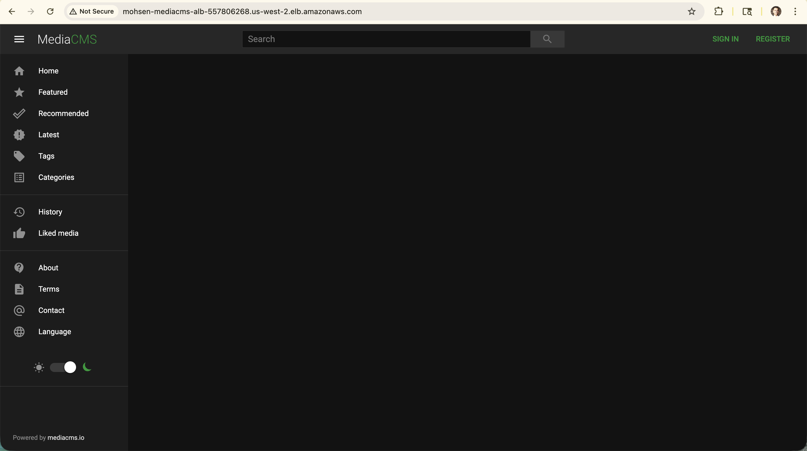

# MediaCMS on AWS - Infrastructure as Code



A production-ready deployment of [MediaCMS](https://mediacms.io/) on AWS using Terraform and ECS Fargate.

## Architecture Overview

This project deploys a fully containerized video sharing platform with:
- **ECS Fargate** - Serverless container orchestration
- **Application Load Balancer** - HTTP/HTTPS traffic distribution
- **RDS PostgreSQL** - Database with Multi-AZ for high availability
- **ElastiCache Redis** - Caching layer with automatic failover
- **S3** - Media file storage with encryption
- **CloudWatch** - Monitoring and alerts
- **VPC** - Isolated network with public/private subnets across 3 AZs


## Prerequisites

### Required Tools
- [Terraform](https://www.terraform.io/downloads) >= 1.0
- [AWS CLI](https://aws.amazon.com/cli/) >= 2.0
- AWS Account with appropriate permissions

### AWS Permissions Required
Your AWS user/role needs permissions for:
- VPC, Subnets, Security Groups
- ECS, Fargate
- RDS, ElastiCache
- S3, IAM
- CloudWatch, SNS
- Application Load Balancer

## Project Structure

```
.
├── terraform/
│   ├── main.tf              # Root module orchestration
│   ├── variables.tf         # Input variables
│   ├── outputs.tf           # Output values
│   ├── provider.tf          # AWS provider configuration
│   ├── terraform.tfvars     # Variable values (DO NOT COMMIT)
│   └── modules/
│       ├── vpc/             # Network infrastructure
│       ├── alb/             # Load balancer
│       ├── ecs/             # Container orchestration
│       ├── rds/             # PostgreSQL database
│       ├── elasticache/     # Redis cache
│       ├── s3/              # Object storage
│       └── monitoring/      # CloudWatch alarms
└── diagrams/                # Architecture diagrams
```

## Deployment Instructions

### Step 1: Clone and Configure

```bash
# Clone the repository
git clone <your-repo-url>
cd AWSFinalProject/terraform

# Configure AWS credentials
aws configure
```

### Step 2: Set Your Variables

Copy the example file and customize with your values:

```bash
cp terraform.tfvars.example terraform.tfvars
nano terraform.tfvars  # Or use your preferred editor
```

**Required changes:**
- `alarm_email` - Your email address for CloudWatch alerts
- `db_password` - A strong, unique password for the database

**Optional changes:**
- `aws_region` - Change if deploying to a different region
- `ecs_task_cpu` / `ecs_task_memory` - Adjust container resources
- `ecs_desired_count` - Number of containers to run
- Other scaling and sizing parameters

**⚠️ IMPORTANT**: Never commit `terraform.tfvars` to version control! It contains secrets.

### Step 3: Initialize Terraform

```bash
terraform init
```

This downloads required providers and modules.

### Step 4: Preview Changes

```bash
terraform plan
```

Review the infrastructure that will be created.

### Step 5: Deploy

```bash
terraform apply
```

Type `yes` when prompted.

**Deployment time**: 10-15 minutes

### Step 6: Get Your Application URL

```bash
terraform output application_url
```

Example output:
```
http://mohsen-mediacms-alb-123456789.us-west-2.elb.amazonaws.com
```


### Step 7: Wait for Application Startup

MediaCMS takes **3-5 minutes** to initialize after deployment:
1. Database migrations run
2. Static files are collected
3. Application server starts

Check container logs:
```bash
aws logs tail /ecs/mohsen-mediacms --follow
```

## Post-Deployment

### Create Admin User

Once the application is running:

1. Access your ALB URL
2. Click "Register" or go to `/register`
3. Create your admin account
4. Start uploading videos!

### Configure Email Alerts

After deployment, AWS SNS will send a subscription confirmation email to the address you specified in `alarm_email`. **Click the confirmation link** to enable CloudWatch alerts.

### Upload Videos

Videos must be uploaded through the MediaCMS web interface:
- Click "Upload" in the MediaCMS UI
- Select your video file
- MediaCMS automatically stores it in S3

**Do not upload files directly to S3** - they won't appear in MediaCMS.

## Monitoring

### CloudWatch Alarms

Automatic alerts are configured for:
- Unhealthy ALB targets
- High ECS CPU (>85%)
- High ECS Memory (>85%)
- High RDS CPU (>80%)
- High Redis CPU (>75%)

View alarms:
```bash
aws cloudwatch describe-alarms --alarm-name-prefix mohsen-mediacms
```

### View Logs

```bash
# ECS container logs
aws logs tail /ecs/mohsen-mediacms --follow

# Last 10 minutes of logs
aws logs tail /ecs/mohsen-mediacms --since 10m
```

## Cost Optimization

### Estimated Monthly Cost (us-west-2)

| Service | Configuration | Est. Cost |
|---------|---------------|-----------|
| ECS Fargate | 2 tasks, 2 vCPU, 4GB RAM | ~$73 |
| RDS PostgreSQL | db.t3.medium, Multi-AZ | ~$120 |
| ElastiCache Redis | 3 nodes, cache.t3.micro | ~$50 |
| ALB | Standard pricing | ~$23 |
| NAT Gateway | 3 AZs | ~$100 |
| S3 | Storage + data transfer | Variable |
| **Total** | | **~$366/month** |

### Save Money

**For development/testing:**
- Reduce `ecs_desired_count` to 1
- Use `db.t3.small` instead of `db.t3.medium`
- Use 1 NAT Gateway instead of 3 (modify VPC module)
- Stop resources when not in use

**Stop everything:**
```bash
# Scale ECS to zero
aws ecs update-service --cluster mohsen-mediacms-cluster \
  --service mohsen-mediacms-service --desired-count 0

# Stop RDS (saves money but keeps data)
aws rds stop-db-instance --db-instance-identifier mohsen-mediacms-db
```

## Troubleshooting

### Container Won't Start

```bash
# Check ECS task status
aws ecs describe-services --cluster mohsen-mediacms-cluster \
  --services mohsen-mediacms-service

# View container logs
aws logs tail /ecs/mohsen-mediacms --since 30m
```

### Database Connection Issues

```bash
# Verify RDS is running
aws rds describe-db-instances --db-instance-identifier mohsen-mediacms-db \
  --query 'DBInstances[0].DBInstanceStatus'

# Force ECS to restart with fresh connections
aws ecs update-service --cluster mohsen-mediacms-cluster \
  --service mohsen-mediacms-service --force-new-deployment
```

### 502/503 Errors from ALB

- Wait 3-5 minutes for containers to fully start
- Check health checks are passing
- Verify security groups allow traffic

```bash
# Check target health
aws elbv2 describe-target-health \
  --target-group-arn $(terraform output -raw target_group_arn)
```

### Out of Memory Errors

Increase task memory in `terraform.tfvars`:
```hcl
ecs_task_memory = "8192"  # 8 GB
```

Then:
```bash
terraform apply
```

## Scaling

### Manual Scaling

```bash
# Scale to 5 containers
aws ecs update-service --cluster mohsen-mediacms-cluster \
  --service mohsen-mediacms-service --desired-count 5
```

### Auto-Scaling

Auto-scaling is configured by default:
- **Target**: 70% CPU utilization
- **Min**: 2 containers
- **Max**: 10 containers
- **Scale out**: When CPU > 70% for 1 minute
- **Scale in**: When CPU < 70% for 5 minutes

Adjust in `terraform.tfvars`:
```hcl
ecs_min_capacity  = 2
ecs_max_capacity  = 20
cpu_target_value  = 70
```

## Backup and Recovery

### Database Backups

Automatic backups are enabled:
- **Retention**: 7 days
- **Backup window**: 3:00-4:00 AM UTC
- **Maintenance window**: Monday 4:00-5:00 AM UTC

Manual snapshot:
```bash
aws rds create-db-snapshot \
  --db-instance-identifier mohsen-mediacms-db \
  --db-snapshot-identifier mediacms-manual-snapshot-$(date +%Y%m%d)
```

### Redis Snapshots

Automatic snapshots:
- **Retention**: 5 days
- **Snapshot window**: 4:00-5:00 AM UTC

## Cleanup / Destroy

### Destroy All Resources

```bash
terraform destroy
```

Type `yes` when prompted.

**Note**: This will:
- ✅ Delete all AWS resources
- ❌ **Permanently delete all uploaded videos and data**
- ✅ Stop all charges

### Partial Cleanup

Keep VPC but remove applications:
```bash
# Scale ECS to zero
aws ecs update-service --cluster mohsen-mediacms-cluster \
  --service mohsen-mediacms-service --desired-count 0

# Then selectively destroy
terraform destroy -target=module.ecs
terraform destroy -target=module.rds
```

## Security Best Practices

### Implemented

- ✅ Private subnets for containers and databases
- ✅ Security groups restrict traffic to minimum required
- ✅ RDS encryption at rest enabled
- ✅ S3 encryption at rest enabled
- ✅ Redis encryption at rest enabled
- ✅ IAM roles follow least privilege principle
- ✅ VPC with isolated network segments

### Recommended Additions

For production use, consider:

- **HTTPS/SSL**: Add ACM certificate to ALB
- **WAF**: Add AWS WAF rules to ALB
- **Secrets Manager**: Store database password in AWS Secrets Manager
- **VPC Flow Logs**: Enable for network monitoring
- **GuardDuty**: Enable for threat detection
- **Backup vault**: Use AWS Backup for centralized backups

## FAQ

### Q: Can I use my own domain name?

Yes! Add a Route 53 record pointing to your ALB DNS name, then configure an SSL certificate with ACM.

### Q: How do I enable HTTPS?

1. Request SSL certificate in ACM
2. Update ALB listener to use port 443
3. Add certificate ARN to ALB configuration

### Q: Can I change the database password after deployment?

Yes, but you'll need to:
1. Update RDS password via AWS console
2. Update `terraform.tfvars`
3. Run `terraform apply` to update ECS environment variables
4. Restart ECS service

### Q: How do I migrate from this setup to another region?

1. Take RDS snapshot
2. Copy snapshot to new region
3. Update `terraform.tfvars` with new region
4. Run `terraform apply` in new region
5. Restore RDS from snapshot

## Support and Contributions

This is a student project for educational purposes.

### Architecture Diagrams

See `/diagrams` folder for:
- Infrastructure component diagram
- User registration flow
- Video upload sequence
- Video sharing workflow

## License

This infrastructure code is provided as-is for educational purposes.

MediaCMS is licensed under AGPL v3.0 - see [MediaCMS repository](https://github.com/mediacms-io/mediacms) for details.

## Acknowledgments

- [MediaCMS](https://mediacms.io/) - Open source video platform
- [AWS](https://aws.amazon.com/) - Cloud infrastructure
- [Terraform](https://www.terraform.io/) - Infrastructure as Code

---

**Built by**: Mohsen Minai  
**Course**: AWS Cloud Computing Final Project  
**Date**: November 2025
